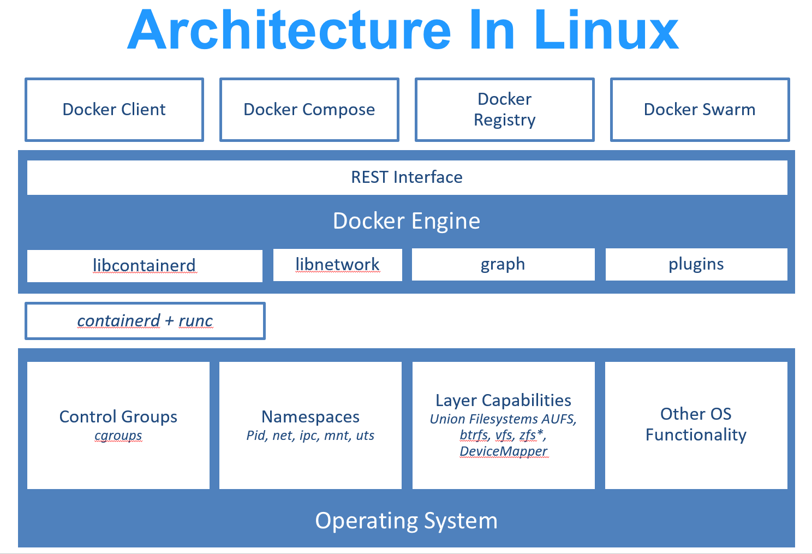

# docker notes

Docker 使用 Google 公司推出的 Go 语言 进行开发实现，基于 Linux 内核的 cgroup，namespace，以及 OverlayFS 类的 Union FS 等技术，对进程进行封装隔离，属于 操作系统层面的虚拟化技术。



传统虚拟机技术是虚拟出一套硬件后，在其上运行一个完整操作系统，在该系统上再运行所需应用进程；而容器内的应用进程直接运行于宿主的内核，容器内没有自己的内核，而且也没有进行硬件虚拟。因此容器要比传统虚拟机更为轻便。

## 1. 镜像，容器和仓库

### 1.1 镜像

操作系统分为 内核 和 用户空间。对于 Linux 而言，内核启动后，会挂载 root 文件系统为其提供用户空间支持。而 Docker 镜像（Image），就相当于是一个 root 文件系统。
Docker 镜像 是一个特殊的文件系统，除了提供容器运行时所需的程序、库、资源、配置等文件外，还包含了一些为运行时准备的一些配置参数（如匿名卷、环境变量、用户等）。镜像 不包含 任何动态数据，其内容在构建之后也不会被改变。

#### 分层存储

因为镜像包含操作系统完整的 root 文件系统，其体积往往是庞大的，因此在 Docker 设计时，就充分利用 Union FS 的技术，将其设计为分层存储的架构。所以严格来说，镜像并非是像一个 ISO 那样的打包文件，镜像只是一个虚拟的概念，其实际体现并非由一个文件组成，而是由一组文件系统组成，或者说，由多层文件系统联合组成。
镜像构建时，会一层层构建，前一层是后一层的基础。每一层构建完就不会再发生改变，后一层上的任何改变只发生在自己这一层。比如，删除前一层文件的操作，实际不是真的删除前一层的文件，而是仅在当前层标记为该文件已删除。在最终容器运行的时候，虽然不会看到这个文件，但是实际上该文件会一直跟随镜像。因此，在构建镜像的时候，需要额外小心，每一层尽量只包含该层需要添加的东西，任何额外的东西应该在该层构建结束前清理掉。
分层存储的特征还使得镜像的复用、定制变的更为容易。甚至可以用之前构建好的镜像作为基础层，然后进一步添加新的层，以定制自己所需的内容，构建新的镜像。

### 1.2 容器

镜像（Image）和容器（Container）的关系，就像是面向对象程序设计中的 类 和 实例 一样，镜像是静态的定义，容器是镜像运行时的实体。容器可以被创建、启动、停止、删除、暂停等。
容器的实质是进程，但与直接在宿主执行的进程不同，容器进程运行于属于自己的独立的 命名空间。因此容器可以拥有自己的 root 文件系统、自己的网络配置、自己的进程空间，甚至自己的用户 ID 空间。容器内的进程是运行在一个隔离的环境里，使用起来，就好像是在一个独立于宿主的系统下操作一样。
前面讲过镜像使用的是分层存储，容器也是如此。每一个容器运行时， **是以镜像为基础层，在其上创建一个当前容器的存储层，我们可以称这个为容器运行时读写而准备的存储层为容器存储层。**
容器存储层的生存周期和容器一样，容器消亡时，容器存储层也随之消亡。因此，任何保存于容器存储层的信息都会随容器删除而丢失。
按照 Docker 最佳实践的要求，容器不应该向其存储层内写入任何数据，容器存储层要保持无状态化。所有的文件写入操作，都应该使用 数据卷（Volume）、或者 绑定宿主目录，在这些位置的读写会跳过容器存储层，直接对宿主（或网络存储）发生读写，其性能和稳定性更高。
数据卷的生存周期独立于容器，容器消亡，数据卷不会消亡。因此，使用数据卷后，容器删除或者重新运行之后，数据不会丢失。

### 1.3 仓库

类似于github

## 2. 镜像

### 2.1 基本命令

#### 拉取镜像 docker pull

eg: docker pull ubuntu:16.04

#### 运行镜像 docker run

docker run [-i ｜ -t | -d | --rm | -p | ] image_name
容器在后台跑起来后可以通过执行 **docker exec -it webserver bash** 来进入容器。

在修改完容器的存储层后，可以通过 **docker diff {container_name}** 来查看具体改动。之后可以使用 **docker commit** 来将存储层保存下来成为镜像。

> Tip：在存储层改动，会有大量的无关内容被添加进来，将会导致镜像极为臃肿。
> 使用 **docker commit** 意味着所有对镜像的操作都是黑箱操作，生成的镜像也被称为 黑箱镜像，换句话说，就是除了制作镜像的人知道执行过什么命令、怎么生成的镜像，别人根本无从得知。而且，即使是这个制作镜像的人，过一段时间后也无法记清具体的操作。

#### 保存镜像 docker commit

docker commit [options] {container_id} [{仓库名}[:{标签}]]

#### 查看历史改动 docker history

docker history {container_id:tag}

#### 列出镜像 docker image ls 

docker image ls [-a | -f | -q | --format | --digests] {pattern}

- -a：列出所有镜像，默认只列出顶层镜像
- -f：添加过滤条件
- -q：
- --format：按照format显示镜像信息
- --digests：显示镜像摘要（SHA256）

docker system df 命令来便捷的查看镜像、容器、数据卷所占用的空间。

#### 虚悬镜像

仓库名、标签均为none的镜像，由于新旧镜像同名，旧镜像名称被取消，从而出现仓库名、标签均为 <none> 的镜像。除了 docker pull 可能导致这种情况，docker build 也同样可以导致这种现象。。可以通过 **docker image prune** 删除。

#### 删除镜像 docker image rm {image_name|image_id|digest}

通过镜像名、id、摘要来删除镜像。如果正在运行的容器依赖某个镜像则无法删除。删除不一定会真的删除，有可能只是Untagged，类似于引用计数。

### 2.2 Dockerfile构建

把每一层修改、安装、构建、操作的命令都写入一个脚本，用这个脚本来构建、定制镜像，那么之前提及的无法重复的问题、镜像构建透明性的问题、体积的问题就都会解决。这个脚本就是 Dockerfile。

#### dockerfile

```dockerfile
# 指定基础镜像,必须为首条指令（scratch表示空白镜像）
FROM {base_image}       
# RUN 执行一些shell命令 
# RUN {cmd}
# RUN ['程序', '参数', '参数', '...']
# 启动一个容器、执行命令、然后提交存储层文件变更。
RUN set -x; buildDeps='gcc libc6-dev make wget' \
    && apt-get update \
    && apt-get install -y $buildDeps \
    && wget -O redis.tar.gz "http://download.redis.io/releases/redis-5.0.3.tar.gz" \
    && mkdir -p /usr/src/redis \
    && tar -xzf redis.tar.gz -C /usr/src/redis --strip-components=1 \
    && make -C /usr/src/redis \
    && make -C /usr/src/redis install \
    && rm -rf /var/lib/apt/lists/* \
    && rm redis.tar.gz \
    && rm -r /usr/src/redis \
    && apt-get purge -y --auto-remove $buildDeps
# COPY复制文件, 使用 COPY 指令，源文件的各种元数据都会保留。
# 比如读、写、执行权限、文件变更时间等。这个特性对于镜像定制很有用。
# 特别是构建相关文件都在使用 Git 进行管理的时候。
# COPY [--chown=<user>:<group>] <源路径>... <目标路径>
# COPY [--chown=<user>:<group>] ["<源路径1>",... "<目标路径>"]
COPY --chown=55:mygroup files* /mydir/
# ADD拷贝，如果源文件是一个tar压缩文件的话ADD指令将会自动解压缩这个压缩文件到 <目标路径> 去。
# ADD 指令会令镜像构建缓存失效 
ADD --chown=55:mygroup somthing.tar.gz /
# CMD 不要以service的形式运行，因为主进程实际上是 sh
# 跟在镜像名后面的是 command，运行时会替换 CMD 的默认值。
CMD ["nginx", "-g", "daemon off;"]
# ENTRYPOINT：
# 1. 让镜像变成像命令一样使用
# 2. 应用运行前的准备工作
ENTRYPOINT ["docker-entrypoint.sh"]
# ENV设置环境变量
ENV <key1>=<value1> <key2>=<value2>...
# ARG设置构建参数 
# ARG <参数名>[=<默认值>]
# ARG 指令有生效范围，如果在 FROM 指令之前指定，那么只能用于 FROM 指令中。
ARG DOCKER_USERNAME=library
# VOLUME 定义匿名卷 
# VOLUME ["<路径1>", "<路径2>"...]
VOLUME /data
# EXPOSE 暴露端口 
# EXPOSE <端口1> [<端口2>...]
# 在 Dockerfile 中写入这样的声明有两个好处，一个是帮助镜像使用者理解这个镜像服务的守护端口，
# 以方便配置映射；另一个用处则是在运行时使用随机端口映射时，也就是 docker run -P 时，
# 会自动随机映射 EXPOSE 的端口。
# EXPOSE 仅仅是声明容器打算使用什么端口而已，并不会自动在宿主进行端口映射。

# WORKDIR 指定工作目录
WORKDIR /app

# USER 指定当前用户，用户必须事先创建好
# 格式：USER <用户名>[:<用户组>]
# 希望以某个已经建立好的用户来运行某个服务进程，不要使用 su 或者 sudo，
# 这些都需要比较麻烦的配置，而且在 TTY 缺失的环境下经常出错。建议使用 gosu。
USER redis

# HEALTHCHECK 健康检查
# HEALTHCHECK [选项] CMD <命令>
# docker inspect查看健康状态
HEALTHCHECK --interval=5s --timeout=3s \
    CMD curl -fs http://localhost/ || exit 1

# ONBUILD RUN ...
# 它后面跟的是其它指令，比如 RUN, COPY 等，而这些指令，在当前镜像构建时并不会被执行。
# 只有当以当前镜像为基础镜像，去构建下一级镜像的时候才会被执行。
ONBUILD COPY ./package.json /app

# LABEL 为镜像添加元数据
# LABEL <key>=<value> <key>=<value> <key>=<value> ...
# 可以用一些标签来申明镜像的作者、文档地址等
LABEL org.opencontainers.image.authors="yeasy"
```

dockerfile中的每一条指令都会建立一层，Union fs是有最大层数限制的，目前是127。 **镜像是多层存储，每一层的东西并不会在下一层被删除，会一直跟随着镜像。因此镜像构建时，一定要确保每一层只添加真正需要添加的东西，任何无关的东西都应该清理掉。**

**Docker 不是虚拟机，容器中的应用都应该以前台执行，而不是像虚拟机、物理机里面那样，用 systemd 去启动后台服务，容器内没有后台服务的概念。**

#### 多阶段构建 v17.05+

```dockerfile
FROM golang:alpine as builder

RUN apk --no-cache add git

WORKDIR /go/src/github.com/go/helloworld/

RUN go get -d -v github.com/go-sql-driver/mysql

COPY app.go .

RUN CGO_ENABLED=0 GOOS=linux go build -a -installsuffix cgo -o app .

FROM alpine:latest as prod

RUN apk --no-cache add ca-certificates

WORKDIR /root/
# 从其他镜像复制文件
COPY --from=0 /go/src/github.com/go/helloworld/app .

CMD ["./app"]
```

#### 构建镜像 docker build

docker build [-t] {上下文路径} [--build-arg {key}={value}]

一般来说，应该会将 Dockerfile 置于一个空目录下，或者项目根目录下。如果该目录下没有所需文件，那么应该把所需文件复制一份过来。如果目录下有些东西确实不希望构建时传给 Docker 引擎，那么可以用 .gitignore 一样的语法写一个 .dockerignore，该文件是用于剔除不需要作为上下文传递给 Docker 引擎的。

docker build支持：
- 本地构建
- 从git repo构建
- 从给定的tar包构建
- 从stdin中读取dockerfile构建

## 3. 容器

### 3.1 基本操作

#### docker container ls

查看当前容器列表

#### docker container logs {container_id}

获取容器的输出信息

#### docker run
docker run [-i ｜ -t | -d | --rm | -p | ] image_name

- -i:使容器的标准输入保持打开
- -t：为容器分配一个伪终端
- -d：让docker在后台运行

#### docker container start | stop | restart | rm ｜ prune

启动、停止、重启、删除、清理已中止容器。

#### 进入后台运行的容器

docker attach {container_id}    此处进行exit会使容器停止
docker exec [-i | -t |...] {container_id}   此处进行exit不会使容器停止

#### 导入导出容器

docker export {container_id} > {export_name}
docker import {import_url | import_name}

## 3. 数据管理

### 3.1 数据卷

数据卷 是一个可供一个或多个容器使用的特殊目录，它绕过 UnionFS，可以提供很多有用的特性：
- 数据卷 可以在容器之间共享和重用
- 对 数据卷 的修改会立马生效
- 对 数据卷 的更新，不会影响镜像
- 数据卷 默认会一直存在，即使容器被删除

> 注意：数据卷 的使用，类似于 Linux 下对目录或文件进行 mount，镜像中的被指定为挂载点的目录中的文件会复制到数据卷中（仅数据卷为空时会复制）。

数据卷 是被设计用来持久化数据的，它的生命周期独立于容器，Docker 不会在容器被删除后自动删除 数据卷，并且也不存在垃圾回收这样的机制来处理没有任何容器引用的 数据卷。如果需要在删除容器的同时移除数据卷。可以在删除容器的时候使用 docker rm -v 这个命令。

#### 常用命令

- docker volume create {my-vol} 创建一个数据卷
- docker volume ls 查看所有的 数据卷
- docker volume inspect {my-vol} 查看指定数据卷信息
- docker volume rm {my-vol} 删除数据卷
- docker run --mount source=my-vol,target=/usr/share/nginx/html nginx:alpine 启动一个挂载数据卷的容器
- docker volume prune 清理无主数据卷

### 3.2 挂载主机目录

```sh
docker run -d -P \
    --name web \
    --mount type=bind,source=/src/webapp,target=/usr/share/nginx/html \
    nginx:alpine
```

## 4. 网络

### 4.1 端口映射

- run时使用 **-p 指定地址:宿主机端口:容器端口/协议** 来指定映射，或者使用-P来随机映射一个端口到内部容器开放的网络端口。

- docker port {container_id} 查看映射信息

### 4.2 容器互联 network

### 4.3 配置DNS

### 4.4 高级网络配置

## 5. Docker Compose

在日常工作中，经常会碰到需要多个容器相互配合来完成某项任务的情况。例如要实现一个 Web 项目，除了 Web 服务容器本身，往往还需要再加上后端的数据库服务容器，甚至还包括负载均衡容器等。
Compose 恰好满足了这样的需求。它允许用户通过一个单独的 docker-compose.yml 模板文件（YAML 格式）来定义一组相关联的应用容器为一个项目（project）。
Compose 中有两个重要的概念：
- 服务 (service)：一个应用的容器，实际上可以包括若干运行相同镜像的容器实例。
- 项目 (project)：由一组关联的应用容器组成的一个完整业务单元，在 docker-compose.yml 文件中定义。
Compose 的默认管理对象是项目，通过子命令对项目中的一组容器进行便捷地生命周期管理。

### 5.1 常用命令

- build:构建（重新构建）项目中的服务容器。
- config:验证 Compose 文件格式是否正确
- down:此命令将会停止 up 命令所启动的容器，并移除网络
- exec:进入指定的容器。
- images:列出 Compose 文件中包含的镜像。
- kill:发送 SIGKILL 信号来强制停止服务容器。
- logs:查看服务容器的输出。
- pause:暂停一个服务容器。
- port:打印某个容器端口所映射的公共端口。
- ps:列出项目中目前的所有容器。
- pull:拉取服务依赖的镜像。
- push:推送
- restart:重启服务
- rm:删除所有（停止状态的）服务容器。推荐先执行 docker-compose stop 命令来停止容器。
- run:在指定服务上执行一个命令。
- scale:设置指定服务运行的容器个数。
- start|stop|pause|unpause|unpause
- up:尝试自动完成包括构建镜像，（重新）创建服务，启动服务，并关联服务相关容器的一系列操作。

## 6. Docker实现

> Docker 底层的核心技术包括 Linux 上的命名空间（Namespaces）、控制组（Control groups）、Union 文件系统（Union file systems）和容器格式（Container format）。
我们知道，传统的虚拟机通过在宿主主机中运行 hypervisor 来模拟一整套完整的硬件环境提供给虚拟机的操作系统。虚拟机系统看到的环境是可限制的，也是彼此隔离的。 这种直接的做法实现了对资源最完整的封装，但很多时候往往意味着系统资源的浪费。 例如，以宿主机和虚拟机系统都为 Linux 系统为例，虚拟机中运行的应用其实可以利用宿主机系统中的运行环境。
我们知道，在操作系统中，包括内核、文件系统、网络、PID、UID、IPC、内存、硬盘、CPU 等等，所有的资源都是应用进程直接共享的。 要想实现虚拟化，除了要实现对内存、CPU、网络IO、硬盘IO、存储空间等的限制外，还要实现文件系统、网络、PID、UID、IPC等等的相互隔离。 前者相对容易实现一些，后者则需要宿主机系统的深入支持。
随着 Linux 系统对于命名空间功能的完善实现，程序员已经可以实现上面的所有需求，让某些进程在彼此隔离的命名空间中运行。大家虽然都共用一个内核和某些运行时环境（例如一些系统命令和系统库），但是彼此却看不到，都以为系统中只有自己的存在。这种机制就是容器（Container），利用命名空间来做权限的隔离控制，利用 cgroups 来做资源分配。

### 6.1 命名空间

命名空间是 Linux 内核一个强大的特性。每个容器都有自己单独的命名空间，运行在其中的应用都像是在独立的操作系统中运行一样。命名空间保证了容器之间彼此互不影响。

#### pid命名空间

不同用户的进程就是通过 pid 命名空间隔离开的，且不同命名空间中可以有相同 pid。所有的 LXC 进程在 Docker 中的父进程为 Docker 进程，每个 LXC 进程具有不同的命名空间。同时由于允许嵌套，因此可以很方便的实现嵌套的 Docker 容器。

#### net命名空间

有了 pid 命名空间，每个命名空间中的 pid 能够相互隔离，但是网络端口还是共享 host 的端口。网络隔离是通过 net 命名空间实现的， 每个 net 命名空间有独立的 网络设备，IP 地址，路由表，/proc/net 目录。这样每个容器的网络就能隔离开来。Docker 默认采用 veth 的方式，将容器中的虚拟网卡同 host 上的一 个Docker 网桥 docker0 连接在一起。

#### ipc命名空间

容器中进程交互还是采用了 Linux 常见的进程间交互方法(interprocess communication - IPC)， 包括信号量、消息队列和共享内存等。然而同 VM 不同的是，容器的进程间交互实际上还是 host 上具有相同 pid 命名空间中的进程间交互，因此需要在 IPC 资源申请时加入命名空间信息，每个 IPC 资源有一个唯一的 32 位 id。

#### mnt命名空间

类似 chroot，将一个进程放到一个特定的目录执行。mnt 命名空间允许不同命名空间的进程看到的文件结构不同，这样每个命名空间 中的进程所看到的文件目录就被隔离开了。同 chroot 不同，每个命名空间中的容器在 /proc/mounts 的信息只包含所在命名空间的 mount point。

#### uts命名空间

UTS("UNIX Time-sharing System") 命名空间允许每个容器拥有独立的 hostname 和 domain name， 使其在网络上可以被视作一个独立的节点而非 主机上的一个进程。

#### user命名空间

每个容器可以有不同的用户和组 id， 也就是说可以在容器内用容器内部的用户执行程序而非主机上的用户。

